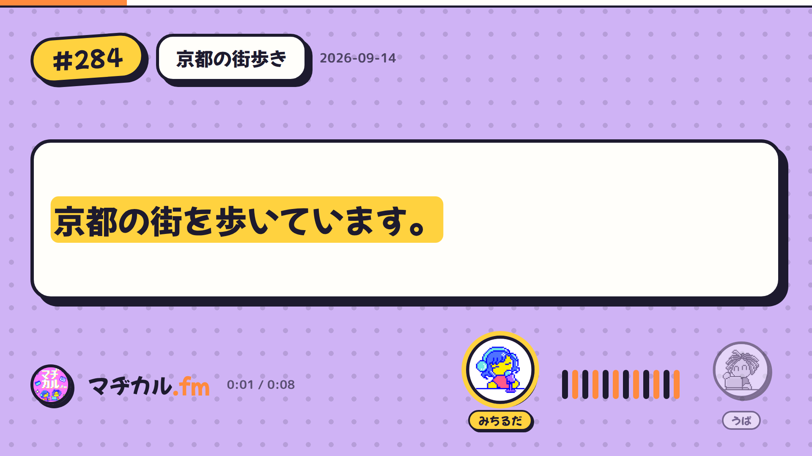
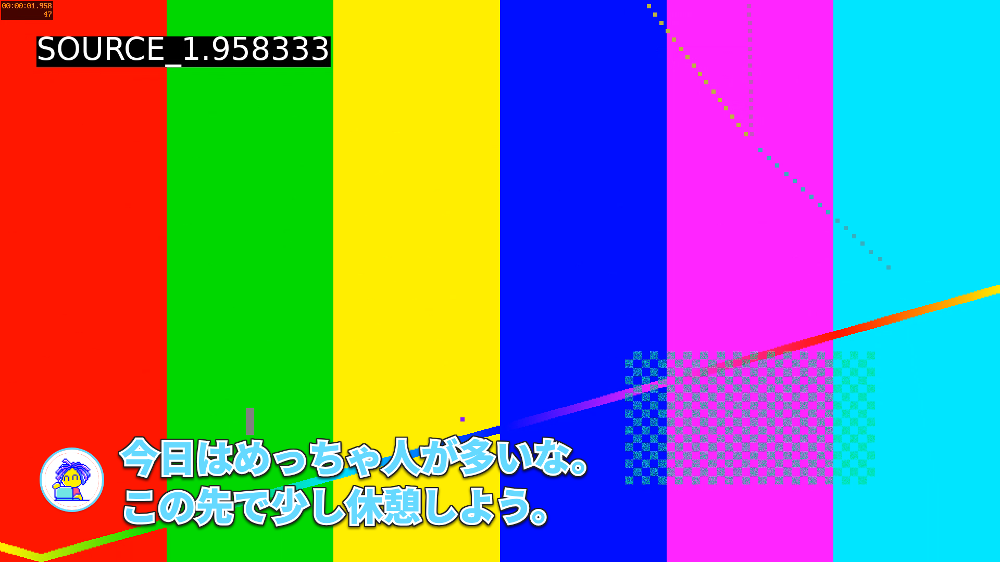
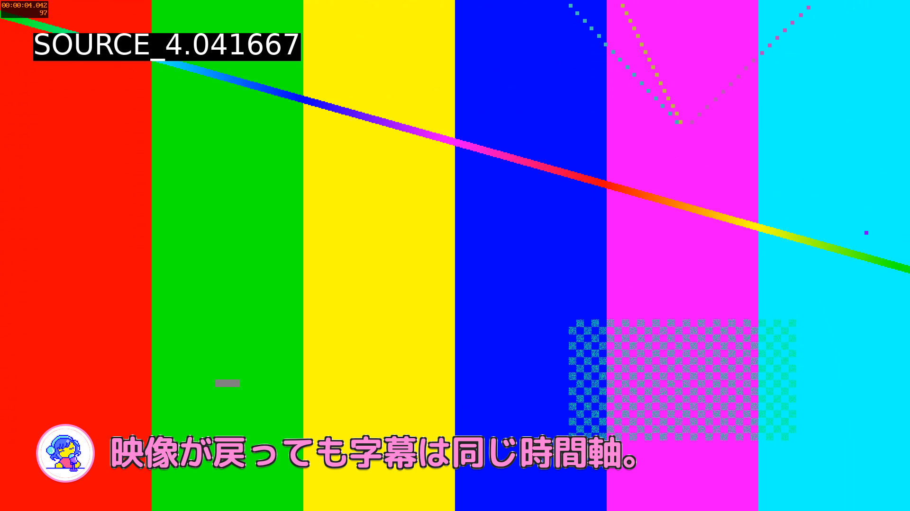

# Hybrid Video Podcast Pipeline (v2)

完成Podcast音声を唯一のmaster timelineにする。前半は従来のEpisode、映像がある区間は実写に切り替える。Remotionは4.0.243のまま。

後半は**発話中のホスト一人のアイコンを字幕の左側**に配置する。暗幕・グラデーション・字幕カードは使わない。michiruはピンク、upamuneは水色の**けいふぉんと！**に白フチ、細い黒フチ1px、文字の影を付け、最大2行のYouTube風テロップにする。字幕の話者はCaptionPage.speaker。字幕の保持中もその話者を表示する。

実写区間のテロップはページ単位で切り替え、表示中の文字位置は固定する。読み上げに追従する単語の上下移動・強調アニメーションは付けない。前半のClassic画面のカラオケ強調は維持する。

## 生素材を置いて実行

```text
video/work/ep-N/
  source/
    mic1/
      録音ファイル1.wav
      録音ファイル2.wav
      ...
    mic2/
      録音ファイル1.wav
      録音ファイル2.wav
      ...
    camera/
      osmo-001.mp4
      osmo-002.mp4
  session.json                 # 通常は省略可
```

マイクごとの分割ファイルをすべてそのまま置く。ファイル名を変更する必要はない。`source/`を省略して直下にmic1/mic2/cameraを置くこともできる。cameraは任意。既定は **mic1=michiru、mic2=upamune**。逆ならsession.jsonで対応を入れ替える。

必要なものはPython 3.12以上、uv、ffmpeg/ffprobe、bun、RemotionのChrome。リポジトリルートで`bun install`、`video/`で`bun install --frozen-lockfile`を済ませる。以下は`video/`で実行する。

```sh
uv run scripts/hybrid_pipeline.py work/ep-N --episode N --title '京都の街歩き' --resolve
```

このコマンドが行うこと：

1. 分割WAVの形式・順序・録音時刻を調査し、マイクごとに結合する。
2. 複数位置の音声波形からmic1/mic2の開始差とクロックドリフトを推定する。
3. 48kHz floatで時間を合わせ、音量調整と緩やかなゲイン配分でmaster WAV/MP3を作る。
4. Osmo内蔵音声をmasterに同期し、動画の速度補正を前処理で焼き込む。Osmo音声は最終音声に混ぜない。
5. YuNetで全出力フレームの顔を自動検出し、拡張した矩形に強いぼかしを焼き込む。
6. master音声をローカルWhisperで文字起こしし、マイク別の音量から話者を割り当て、既存buildで字幕ページを作る。
7. `--resolve`指定時は、起動中のResolve Studioに新規プロジェクトを作り、master音声・同期済みclean動画・確認マーカーを配置する。

初回はPython依存・YuNet・Whisperモデルをダウンロードする。標準Whisperはlarge-v3-turbo、CPU int8。モデル推論と全フレーム顔検出は長尺では時間がかかる。`--no-transcribe`で素材処理だけ先に実行できる。Resolveを使わないマシンでは`--resolve`を外す。

生成物は`work/ep-N/runs/<内容ハッシュ>/`。`latest-run.json`にrunの場所を記録する。入力、設定、処理コード、顔モデルが変われば別runになり、完了済みrunを再利用する際は出力ハッシュを検証する。rawは変更しない。作業中に入力を書き換えない。

## Hollylandの分割録音

調査対象はLARK MAX 2。公式マニュアルでは内蔵8GB、48kHz/24bitで約14時間、48kHz/32bit floatで約10時間、ファイル名はマイク内部時計に基づき、USB-C経由で取り出すと説明されている。タイムコード有効時はファイルに時刻情報を埋め込む。

出典：[Hollyland LARK MAX 2公式マニュアル、EN-23](https://download.hollyland.com/User_manual/LARK%20MAX%202/2%20Mic%20%26%201%20RX/User%20Manual/LARK%20MAX%202%20-%20User%20Manual%20-%20English.pdf)

**固定サイズで分割されることを前提に複数ファイルを受け付ける。分割サイズ・分割時間はコードに固定しない。** MAX 2の具体的なファイル名文法・分割閾値は上記資料から確定できない。初代MAXの30分分割仕様をMAX 2へ流用しない。実ファイルをffprobeで調べ、32bit floatの1.0を超える振幅も整数化せず保持してから音量調整する。

- BWFの録音日＋サンプル時刻があればその精度で配置する。
- 年月日＋時分秒の一般的なファイル名なら時刻順に並べる。秒単位の丸めによる約1秒以内の差は連続分割としてサンプル数でつなぐ。長い停止時間は無音で保持する。
- 時刻が読めない場合は自然順（1, 2, 10）で連結し、ログに明示する。OSのコピー時刻を録音時刻にしない。
- **時刻のない録音や秒未満の停止は自動分割と区別できない。** 停止・再開した場合は`fileStartSec`で各ファイルの開始位置を指定する。録音順が自然順と異なる場合も同様。
- マイク間は時計が一致すると仮定せず、共有音声の波形で合わせる。3個以上の離れた一致点・相関・残差・ドリフト上限を満たせなければ停止する。別々の声や屋外ノイズで自動同期できない場合は手動の`sync`を指定する。

## 設定と補正

以下の数値は説明用。`fileStartSec`は自然ファイル名順の各ファイルの開始秒で、当該マイク録音の先頭を0とする。通常の連続分割では指定不要。

```json
{
  "episode": {"number": 284, "title": "京都の街歩き", "pubDate": "2026-09-14"},
  "mic1": {"speaker": "michiru"},
  "mic2": {
    "speaker": "upamune",
    "fileStartSec": [0, 600, 1230],
    "sync": {"offsetSec": 2.13, "scale": 1.0001}
  },
  "camera": {
    "osmo-001.mp4": {
      "sync": {"offsetSec": 763.2, "scale": 1},
      "trimStartSec": 3.8,
      "trimEndSec": 0,
      "extraMasks": [{"startSec": 4, "endSec": 8, "rect": [0.1, 0.2, 0.15, 0.2]}]
    }
  },
  "faceDetectionWidth": 1280,
  "transcriptionModel": "large-v3-turbo",
  "transcriptionDevice": "cpu"
}
```

mic2の`reference = offsetSec + scale * mic2Time`のreferenceはmic1時間。早く始まったマイクの先頭が完成masterの0になる。cameraのreferenceは完成master時間、source 0は動画の先頭。`trimStartSec`/`trimEndSec`は元動画の先頭/末尾から使わない秒数。物理的同期を変えずsource trimする。カメラファイルのキーはcamera/からの相対パス。

自動同期は線形ドリフトまで。収録中の不規則な欠落や編集済み素材には手動補正が必要。独立したカメラクリップがmaster上で重複したら停止するため、使う範囲をtrimで決める。

`extraMasks`は検出漏れ用の固定矩形。時間は速度補正済みclean動画の先頭から、矩形は1920×1080出力に対する正規化x/y/幅/高さ。修正して再実行すると別runを生成する。追跡が必要な細かな補正はResolveで行う。

## 顔検出とResolve自動操作

顔検出はOpenCV YuNetの固定SHA-256のモデルを使用する。すべての顔が対象で、ホストだけを顔認識で除外しない。検出矩形を35%広げ、直前0.25秒分も保持してぼかす。フレームごとの矩形・confidenceは`.faces.jsonl`、20秒ごとの検出数・未検出フレーム数は`.review.json`に出力する。

モデル出典：[OpenCV Zoo YuNet](https://github.com/opencv/opencv_zoo/tree/main/models/face_detection_yunet)。MITライセンスを同梱し、モデル取得時にも隣に保存する。

**自動顔検出とResolveのプロジェクト・素材配置・確認マーカー・レンダーキュー操作は実装対象。** Magic MaskのGUI自動クリックには依存せず、顔ぼかしはPythonで映像に焼き込み、Resolveでは確認と追加修正ができる状態にする。

Resolve Studioを起動し、Preferences → System → General → External scripting usingをLocalに設定する。インストール済みのDaVinciResolveScriptモジュールを使用する。別マシンで素材処理した場合はrunフォルダを移し、Resolve側で次を実行できる（Pythonの外部依存は不要）。

```sh
python3 scripts/resolve_hybrid.py work/ep-N/runs/RUN_ID

# 既存の書き出しプリセットを使ってレビュー用レンダーを追加・開始する場合
python3 scripts/resolve_hybrid.py work/ep-N/runs/RUN_ID \
  --render-preset 'Review H264' --start-render
```

毎回新規プロジェクトを作る。24fps/1920×1080/開始timecode 0、A1にmaster音声一つ、V1にclean動画をmaster位置で配置する。整列済みマイクはメディアプールに置く。プロジェクトを保存してDRPバックアップを出し、指定したプリセットがあればレビュー用レンダーを追加する。`--start-render`は今回作ったジョブだけを開始する。レビュー用レンダーは前半が黒画面で、最終Podcast UIは後段のRemotionで付ける。

自動検出済みでも全使用区間を目視確認する。横顔、遠景、交差、遮蔽後、画面端、一瞬の映り込み、暗所を確認する。検出0件は安全判定ではない。Resolveで修正した動画は`*-clean.mov/mp4`へ書き出し、別のmanifestからprepareする。ファイル先頭を切った場合は書き出し後のsourceStartSecを使う。master音声を編集した場合は字幕・同期も再生成する。

出力はSDR/H.264/yuv420p。自動処理はHDRの色変換を設計していないためHDR素材はResolveでSDR化する。映像は1920×1080へcoverでクロップされる。色・構図・手ブレ調整はResolveで行える。

## 確認後に最終レンダー

run内のmanifestにはepisode番号とvideoSegments配列を記録する。fileは同階層のprocessed/内のcleanファイル名のみ。episode.jsonにローカル絶対パスを保存しない。

```json
{
  "episodeNumber": 284,
  "videoSegments": [{
    "file": "osmo-001-clean.mov",
    "timelineStartSec": 767,
    "timelineEndSec": 2650,
    "sourceStartSec": 3.8
  }]
}
```

数値は例。master 763.2秒 = clean 0秒の場合、master 767秒の映像はclean 3.8秒。

```sh
# 人間が該当clean動画を目視確認した後に実行
bun scripts/prepare-episode-video.mjs work/ep-N/runs/RUN_ID/manifest.json --reviewed
bunx remotion studio src/index.ts --props=src/data/episode.json
bun scripts/render-episode.mjs N --concurrency 4 --chunk 2000
```

`--reviewed`は人間による確認済みの申告。エージェントは該当素材の確認完了が伝えられるまで付けない。自動pipelineは確認済みreceiptを作らない。

prepareは存在・有限数・正の区間長・episode/source duration内・非重複・clean名・episode番号を検証し、カメラ音声を除去してpublicへコピーする。元clean・prepared動画・master音声・使用区間のSHA-256をreceiptに結び付ける。再生成したcleanは再確認する。rawをpublicへ置かない。

`build-episode.mjs`を再実行すると映像区間は外れるためprepareを再実行する。自動buildは`--episode-meta`で未公開回にも対応し、`--no-proofread`でOllamaなしで動く。字幕の修正・校正を行った後もprepareをやり直す。話者判定は単語区間の相対マイク音量による推定で、同時発話や強いかぶりは確認する。

手動Resolve工程も引き続き使える。完成masterに対応するtranscriptを用意してbuild → prepare → renderする。videoSegmentsがない従来回はbuild → renderのみ。

## 時刻・キャッシュ・音声

- 区間は`[start, end)`、隙間はClassicに戻る。すべてmaster秒で評価する。
- fpsに乗らない境界は次の出力フレームへ切り上げ、source trimへ反映する。trimの丸めは最大半フレーム（24fpsで約20.8ms）。
- `source = sourceStartSec + masterTime - timelineStartSec`。Remotion 4.0.243のOffthreadVideo.startFromとSequenceを使用する。
- Audioは親で一度だけ再生する。レンダーは無音の動画チャンクを結合してからmasterを一度だけAACエンコードしてmuxする。
- props、素材内容、ソース、依存lock、設定が変わればチャンクキャッシュを分ける。実行中に素材やコードを編集しない。
- 最終出力は必ずrender-episode.mjsを使う。直接remotion renderするとハッシュ・duration検証を迂回する。

## 検証済みの範囲

```sh
bun run test:episode
bun run test:hybrid
bunx tsc --noEmit
```

自動テストは分割32bit floatのサンプル保持、自然順、録音停止の空白、正負offset、1000ppmドリフト、無関係音声/無音の拒否、顔の匿名化矩形、文字起こしアダプタ、Resolveへのmaster配置と限定ジョブ開始を確認する。Whisper推論とResolve APIはmockを使用したテストで、実機検証ではない。

合成素材でmic1の30秒を10.25秒＋19.75秒、mic2の25秒を12秒＋13秒に分割し、取り込みから出力まで実行した。mic2の2.13秒差、カメラの10.65秒差を復元し、8秒/192フレームすべてでテスト顔を検出して焼き込んだ。これは実際の二人の声・京都の街中・群衆での検出精度を保証しない。実素材・Resolve実機・Whisperモデル推論はこの環境では未確認。

Remotionは合成映像で両話者の字幕をレンダー。Classicは以前の比較でピクセル差分ゼロ。実写テロップの`keifont.ttf`は配布元の正式ファイルをローカル読込し、外部フォント通信や代替フォントに依存しない。






